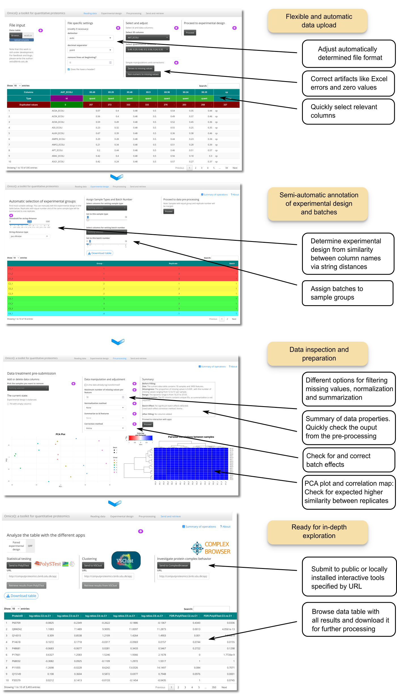

# OmicsQ: A Toolkit for Quantitative Omics Analysis

[](https://opensource.org/licenses/MIT)

OmicsQ is a Shiny-based web application designed for preprocessing and quantitative analysis of Omics data. The app facilitates the preparation of data for subsequent analysis using specialized tools such as [PolySTest](https://computproteomics.bmb.sdu.dk/app_direct/PolySTest/) for statistical testing and [VSClust](https://computproteomics.bmb.sdu.dk/app_direct/VSClust/) for clustering analysis. OmicsQ streamlines the workflow from data preprocessing to submission for further analysis, making it an essential entry point for Omics studies.

You can run OmicsQ via your browser on our server: [OmicsQ](https://computproteomics.bmb.sdu.dk/app_direct/OmicsQ/)

Find more about our research: [ComputProteomics Group Page](https://computproteomics.bmb.sdu.dk/)

## Features

**Interactivity**: Easily browse the data and selectively analyze and visualize according to your needs.   
 
**User-Friendly Experience**: Avoid installation issues by using the app directly in your browser, 
with a simple interface for easy navigation.  
**Flexibility**: Easily upload multiple file formats (text, Excel) and use the automated assignment of sample groups and 
batches.  
**Data Pre-processing**: TODO   
**Web Service Integration**: Submit processed data directly to the following 
tools:  
[PolySTest](https://computproteomics.bmb.sdu.dk/app_direct/PolySTest/) for statistical testing with proper treatment of missing data  
[VSClust](https://computproteomics.bmb.sdu.dk/app_direct/VSClust/) for variance-sensitive clustering analysis also of incomplete data sets  
[ComplexBrowser](https://computproteomics.bmb.sdu.dk/app_direct/ComplexBrowser/) for exploration of quantitative behavior of protein complexes (mainly applicable to proteomics data).  
**Data Export**: Download the processed data or analysis results for further offline analysis.


## Installation

OmicsQ can be run locally or using a Docker container for a seamless setup.

### Option 1: Running Locally

To run OmicsQ locally, follow these steps:

1. Install R (version 4.0 or higher) from CRAN.

2. Install RStudio (optional but recommended) from the RStudio website.

3. Install the required R packages: Open R or RStudio and install the necessary packages by running the following command:

```r
install.packages("BiocManager")
BiocManager::install(c("shiny", "shinyBS", "shinyWidgets", "shinycssloaders", 
                   "shinythemes", "shinyjs", "DT", "data.table", "readxl", 
                   "stringdist", "limma", "matrixStats", "MsCoreUtils", 
                   "jsonlite", "BEclear", "sva", "gridExtra", "ggplot2", 
                   "gplots"))
```

4. Clone the OmicsQ repository: Download the latest version of OmicsQ from GitHub, each in bash:
```
git clone https://github.com/computproteomics/OmicsQ.git
```

5. Run the app: In R or RStudio, set your working directory to the cloned repository, and then start the app:

```r
    shiny::runApp("OmicsQ")
```

### Option 2: Using Docker

For an easier and more consistent setup, OmicsQ is also available as a Docker container. This approach ensures that all 
dependencies are correctly configured and avoids potential installation issues.

1. Install Docker: Follow the instructions on the Docker website to install Docker.

2. Pull the OmicsQ Docker image: Run the following command to download the Docker container.
```
docker pull veitveit/omicsq:latest
```

3. Run the Docker container: Start the OmicsQ app using Docker.

```
docker run --rm -p 3838:3838 computproteomics/omicsq:latest
```

4 Access the app: Open a web browser and go to http://localhost:3838 to access OmicsQ.

## Usage

1. Data Upload: Upload your quantitative Omics dataset in the supported formats (CSV, TSV, or Excel).
2. Experimental Design: Assign sample groups and batches to the uploaded data using our versatile string matching tool.
3. Data Preprocessing: Perform normalization, filtering, missing value filtering and batch correction  
4. Perform advanced methods: Send the preprocessed data directly to the apps PolySTest, VSClust and ComplexBrowser. All in your Browser.
5. Download Results: Export the processed data or analysis results for further offline analysis.

## Workflow

{width=75%}

## License

OmicsQ is released under the MIT License. See the LICENSE file for details.

## Citation

If you use OmicsQ in your research, please cite our work:

Xuan-Tung Trinh et al. OmicsQ: A Toolkit for Quantitative Analysis of Omics Data. TODO.

## Contributing

We welcome contributions! Please submit a pull request or open an issue to get involved.

## Contact

For questions, comments, or suggestions, please contact the development team at [veits@bmb.sdu.dk].