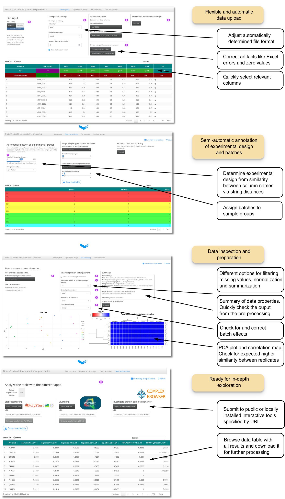

# OmicsQ: A Toolkit for Quantitative Omics Analysis

[](https://opensource.org/licenses/apache-2-0).
[](https://bio.tools/omicsq)
[](https://zenodo.org/badge/latestdoi/869924362)


OmicsQ is a Shiny-based web application designed for preprocessing and quantitative analysis of Omics data. 
It streamlines the preparation of data for subsequent analysis using specialized tools such as 
[PolySTest](https://computproteomics.bmb.sdu.dk/app_direct/PolySTest/) for statistical testing and
[VSClust](https://computproteomics.bmb.sdu.dk/app_direct/VSClust/) for clustering analysis. 

Run OmicsQ via your browser on our server: [OmicsQ](https://computproteomics.bmb.sdu.dk/app_direct/OmicsQ/)

Visit [ComputProteomics Group Page](https://computproteomics.bmb.sdu.dk/) for more information on related research and tools.

## Key features

**Interactivity**: Easily browse the data and selectively analyze and visualize according to your needs.   
 
**User-Friendly Experience**: Avoid installation issues by using the app directly in your browser, 
with a simple interface for easy navigation.  

**Flexibility**: Easily upload multiple file formats (text, Excel) and use the automated assignment of sample groups and 
batches.  

**Data Pre-processing**: Batch correction, normalization, filtering, and missing value filtering with visual feedback.

**Web Service Integration**: Submit processed data directly to the following 
tools:  
[PolySTest](https://computproteomics.bmb.sdu.dk/app_direct/PolySTest/) for statistical testing with proper treatment of missing data  
[VSClust](https://computproteomics.bmb.sdu.dk/app_direct/VSClust/) for variance-sensitive clustering analysis also of incomplete data sets  
[ComplexBrowser](https://computproteomics.bmb.sdu.dk/app_direct/ComplexBrowser/) for exploration of quantitative behavior of protein complexes (mainly applicable to proteomics data).  

**Data Export**: Download the processed data or analysis results for further offline analysis.


## Installation

OmicsQ can be run locally on your machine or via Docker. Pick the option that suits you best.

### Option 1: Run Locally (R)

1) Install R (4.2 or newer) and optionally RStudio.

2) Install required packages. In an R session:

```r
# CRAN packages
install.packages(c(
  "shiny", "shinyBS", "shinyWidgets", "shinycssloaders", "shinythemes",
  "shinyjs", "DT", "data.table", "readxl", "openxlsx", "stringdist",
  "limma", "matrixStats", "jsonlite", "gridExtra", "ggplot2", "gplots",
  "viridis", "ggrepel", "ggiraph"
))

# Bioconductor packages
install.packages("BiocManager")
BiocManager::install(c("MsCoreUtils", "BEclear", "sva", "UniProt.ws"), ask = FALSE)
```

3) Clone this repository and run the app from the repo root:

```bash
git clone https://github.com/computproteomics/OmicsQ.git
cd OmicsQ
```

```r
shiny::runApp(".")
```

### Option 2: Run with Docker

This bundles all dependencies and runs a Shiny server.

Build the image locally:

```bash
git clone https://github.com/computproteomics/OmicsQ.git
cd OmicsQ
docker build -t omicsq .
```

Run the container and expose on port 3838:

```bash
docker run --rm -p 3838:3838 omicsq
```

Open http://localhost:3838 in your browser.

## Documentation and tutorial

For detailed instructions on how to use OmicsQ, please refer to the 
[User Manual](https://computproteomics.bmb.sdu.dk/app_direct/OmicsQ/tutorial/Tutorial.html). 
There, you can also find a tutorial on how to use the app for your data analysis.

## Workflow

{width=75%}

## License

OmicsQ is released under the MIT License. See the LICENSE file for details.

## Citation

If you use OmicsQ in your research, please cite our work:

Xuan-Tung Trinh et al. OmicsQ: A Toolkit for Quantitative Analysis of Omics Data. [preprint](https://arxiv.org/abs/2504.19813)

## Contributing

We welcome contributions! Please submit a pull request or open an issue to get involved.

## Contact

For questions, comments, or suggestions, please contact the development team at [veits@bmb.sdu.dk].
